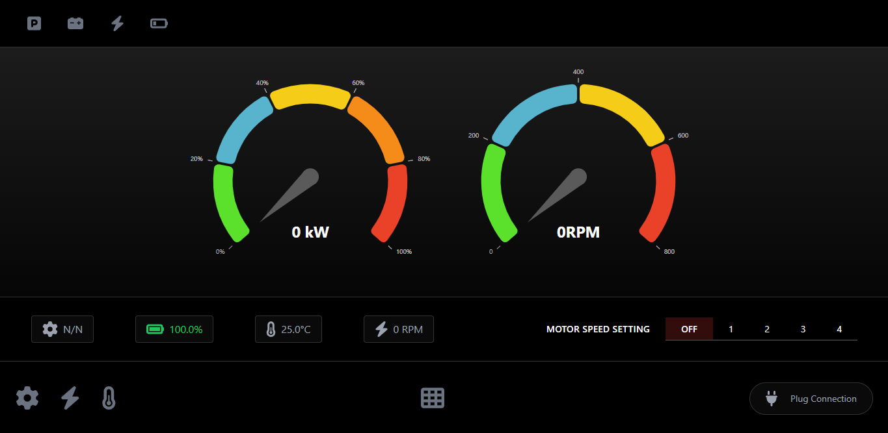

# Car Dashboard UI Simulator

A real-time car dashboard simulator with interactive controls and live metrics visualization. The project consists of a React frontend for the dashboard interface and a Node.js/Firebase backend for simulation and state management.



## Features

### Dashboard Interface
- Real-time power and RPM gauges with smooth animations
- Battery status with dynamic icons and charging indicators
- Temperature monitoring with warning indicators
- Gear ratio display based on motor speed
- Interactive motor speed controls
- Status indicators for parking brake, engine check, motor warnings, and battery levels
- Charging system simulation

### Technical Features
- Real-time WebSocket communication
- Firebase Realtime Database integration
- Responsive gauge animations using react-gauge-component
- Dynamic state management with Socket.IO
- Automated metrics simulation

## Technology Stack

### Frontend
- React.js (v18)
- Vite
- Tailwind CSS
- Socket.io-client
- FontAwesome Icons
- React Gauge Component
- ESLint with React plugins

### Backend
- Node.js
- Express.js
- Socket.IO
- Firebase Admin SDK
- Cors

## Installation

### Prerequisites
- Node.js (v14 or higher)
- npm (Node package manager)
- Firebase account and project

### Backend Setup

1. Navigate to the backend directory:
```bash
cd backend
```

2. Install dependencies:
```bash
npm install
```

3. Create a .env file based on .env.example and fill in your Firebase credentials:
```
DB_USER=root
DB_PASSWORD=password
DB_NAME=car_dashboard
DB_HOST=localhost
PORT=5000 
FIREBASE_PROJECT_ID=your-project-id
FIREBASE_PRIVATE_KEY_ID=your-private-key-id
FIREBASE_PRIVATE_KEY=your-private-key
FIREBASE_CLIENT_EMAIL=your-client-email
FIREBASE_CLIENT_ID=your-client-id
FIREBASE_CLIENT_CERT_URL=your-cert-url
FIREBASE_DATABASE_URL=your-database-url
```

4. Start the backend server:
```bash
npm run dev
```

### Frontend Setup

1. Navigate to the frontend directory:
```bash
cd frontend
```

2. Install dependencies:
```bash
npm install
```

3. Create a .env file based on .env.Example:
```
BACKEND_URL="http://localhost:5000"
```

4. Start the development server:
```bash
npm run dev
```

## Project Structure

```
car-dashboard-ui/
├── backend/
│   ├── config/
│   │   ├── database.js
│   │   └── firebase.js
│   ├── models/
│   │   └── carState.js
│   ├── app.js
│   ├── .env.example
│   └── package.json
└── frontend/
    ├── src/
    │   ├── App.jsx
    │   ├── index.css
    │   └── main.jsx
    ├── public/
    ├── .env.Example
    ├── package.json
    ├── tailwind.config.js
    └── vite.config.js
```

## Key Updates

### Backend Changes
- Migrated from Flask/SQLite to Node.js/Firebase
- Implemented Firebase Realtime Database integration
- Added WebSocket support using Socket.IO
- Enhanced simulation logic for real-time metrics
- Added environment configuration support

### Frontend Changes
- Migrated to Vite build tool
- Added ESLint configuration for React
- Implemented responsive gauge components
- Enhanced UI with Tailwind CSS
- Added real-time WebSocket communication
- Improved state management and animations

## State Management

### Firebase Data Structure
```javascript
{
  "carState": {
    "power": 0,
    "rpm": 0,
    "battery": 100,
    "temperature": 25,
    "charging": false,
    "motor_speed": 0,
    "is_running": false,
    "gear": "N/N",
    "parking_brake": false,
    "check_engine": false,
    "motor_warning": false,
    "battery_low": false,
    "updated_at": "ISO_DATE_STRING"
  }
}
```

## WebSocket Events

### Client to Server
- `set_motor_speed`: Set motor speed (0-4)
- `plug_connection`: Toggle charging state

### Server to Client
- `car_state_update`: Real-time state updates

## Contributing

1. Fork the repository
2. Create your feature branch (`git checkout -b feature/AmazingFeature`)
3. Commit your changes (`git commit -m 'Add some AmazingFeature'`)
4. Push to the branch (`git push origin feature/AmazingFeature`)
5. Open a Pull Request

## License

This project is licensed under the MIT License - see the LICENSE file for details.

## Acknowledgments

- React Gauge Component for gauge visualizations
- FontAwesome for icons
- Tailwind CSS for styling
- Firebase for real-time database
